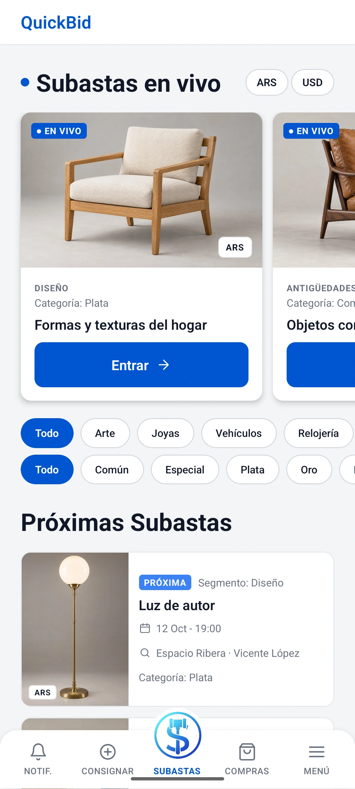
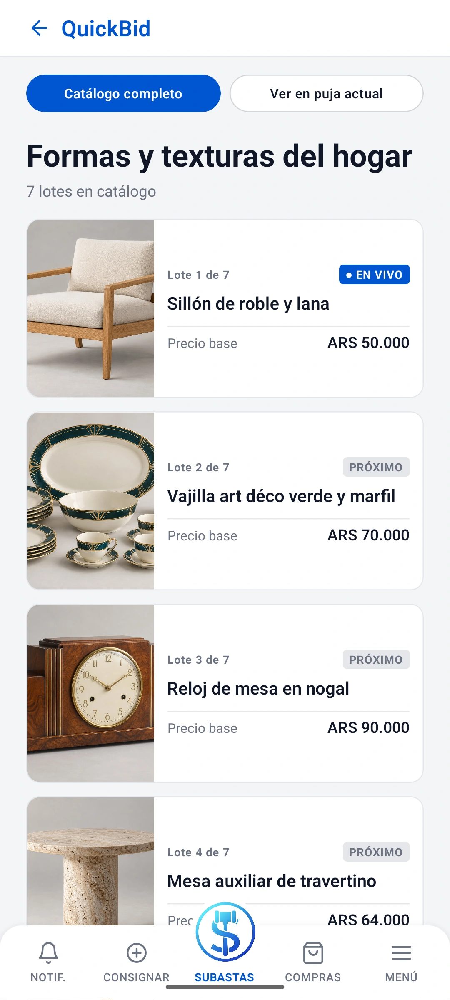
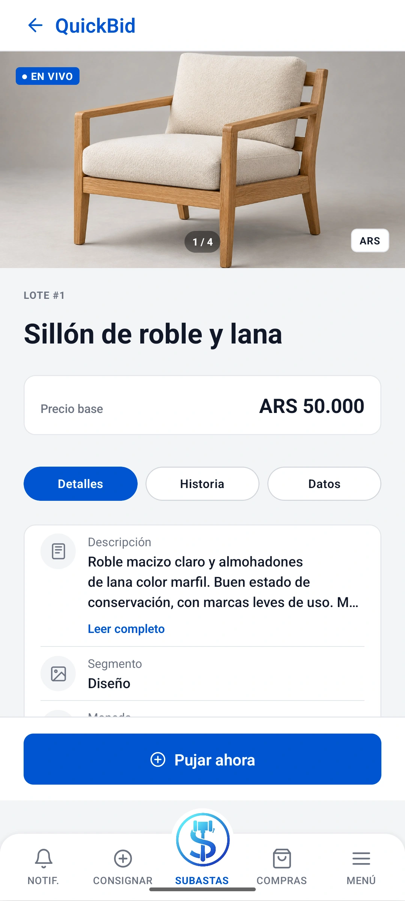
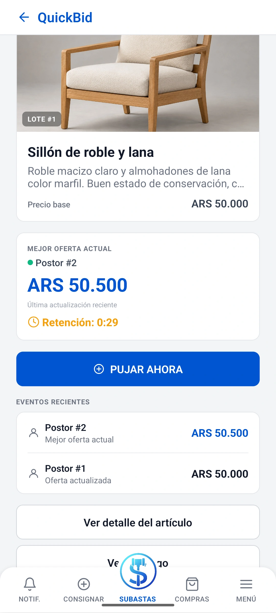

# QuickBid — Mobile App

Mobile auction application developed as a team project using React Native and TypeScript.

QuickBid includes registration and authentication, auction browsing, real-time bidding, purchases, payment methods, consignments, user profiles, and notifications.

The backend is available in [quickbid-backend](https://github.com/AgustinNari/quickbid-backend).

## Features

- User registration and authentication
- Auction and catalog browsing
- Real-time bidding through WebSocket/STOMP
- Purchases and payment-method management
- Product consignments
- User profile management
- Notifications
- Connectivity detection
- Offline consignment drafts stored locally
- Authentication deep links

Operations that require server confirmation, including live bidding, require an active connection.

## Screenshots

<table>
  <tr>
    <td align="center"><strong>Auction Discovery</strong><br><a href="docs/screenshots/auctions.webp"></a></td>
    <td align="center"><strong>Auction Catalog</strong><br><a href="docs/screenshots/auction-catalog.webp"></a></td>
  </tr>
  <tr>
    <td align="center"><strong>Lot Details</strong><br><a href="docs/screenshots/lot-details.webp"></a></td>
    <td align="center"><strong>Live Bidding</strong><br><a href="docs/screenshots/live-bidding.webp"></a></td>
  </tr>
</table>

The screenshots use synthetic users, demonstration data, illustrative item imagery, and simulated payments. The bids shown in the local scenario were submitted through the application's actual bidding workflow.

## Tech Stack

- React Native 0.85
- React 19
- TypeScript
- React Navigation
- AsyncStorage
- WebSocket / STOMP
- Android
- iOS

## Requirements

### General

- Node.js 22.11 or newer
- npm

### Android

- JDK 17
- Android Studio
- Android SDK 36
- NDK 27.1.12297006
- Android API 24 or newer

### iOS

- macOS
- Xcode
- Ruby / Bundler
- CocoaPods

## Installation

```bash
cd FrontendQuickbid
npm ci
```

For iOS:

```bash
bundle install
cd ios
bundle exec pod install
```

Then return to `FrontendQuickbid/`.

## Backend Configuration

API configuration is located in:

```text
FrontendQuickbid/src/api/config.ts
```

The application currently supports three connection modes:

| Mode | Backend |
| --- | --- |
| `public` | Configured public demo backend |
| `localReverse` | `http://localhost:8080` using ADB reverse |
| `emulator` | `http://10.0.2.2:8080` for the Android emulator |

The WebSocket URL is derived from the HTTP/HTTPS backend URL.

For `localReverse`, REST uses `http://localhost:8080` and WebSocket/STOMP uses `ws://localhost:8080`. For `emulator`, both use the Android emulator's host alias `10.0.2.2` on port 8080. The local backend must be running and reachable through the selected route.

Development scripts select `QUICKBID_API_MODE` when Metro starts. `npm start` defaults to `public` when this variable is unset; it does not select the local backend. Restart Metro with the matching `start:*` script when switching environments. Release builds always select `public`.

The backend should use:

```text
quickbid://auth
```

as the frontend base URL for registration and password-recovery links.

## Running the App

Run commands from `FrontendQuickbid/`. For a local backend through ADB reverse, start Metro in one terminal:

```bash
npm run start:local -- --host 127.0.0.1
```

Then, in another terminal:

```bash
npm run android:local
```

This selects `localReverse` and reverses device ports 8081 (Metro) and 8080 (backend). ADB must be available through `ANDROID_HOME/platform-tools` or `PATH`, with an authorized Android device or emulator connected. The Android script checks Metro's environment before installing. With multiple devices, set `ANDROID_SERIAL` to the target serial reported by `adb devices` in the installation terminal; the script uses that same device for port reversal and installation. Do not combine it with `--device`.

When Metro is bound to loopback, set the Android developer menu's **Settings > Debug server host & port for device** to `localhost:8081`. This preference persists across app restarts; configure it again after clearing app storage or using a new emulator. Port reversals must be restored after a device restart, which `android:local` handles.

On Windows PowerShell, use `npm.cmd` instead of `npm` if the installed `npm.ps1` wrapper drops arguments after `--` (for example, `npm.cmd run start:local -- --host 127.0.0.1`).

For the Android emulator host alias, start Metro and then install in another terminal:

```bash
npm run start:emulator
# In another terminal:
npm run android:emulator
```

This selects `emulator`, reverses only Metro's port 8081, and connects directly to the backend through `10.0.2.2:8080`.

For the configured public backend:

```bash
npm run start:public
# In another terminal:
npm run android:public
```

The generic commands `npm start` and `npm run android` also use the default public development configuration when `QUICKBID_API_MODE` is unset. On macOS, after starting Metro, run:

```bash
npm run ios
```

## Validation

Run Jest tests:

```bash
npm test -- --runInBand
```

Run lint:

```bash
npm run lint
```

Run TypeScript validation:

```bash
npx --no-install tsc --noEmit
```

Tests cover components, connectivity behavior, data mapping, payment methods, documents, and consignment drafts.

## Demo Scope

The configured public URL points to a demonstration backend and its availability depends on that service.

Payments and demo data follow the behavior implemented by the backend.

Android currently uses a debug signing configuration for release builds, so the repository should not be considered a production distribution configuration.
